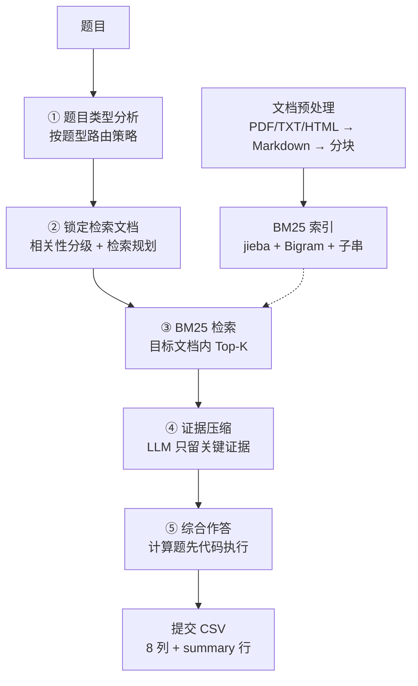

# AFAC2026 · 金融长文本 Agent 高效问答

AFAC2026 赛道四的完整参赛项目：面向保险条款、监管法规、金融合同、上市公司年报、行业研报五类金融长文本，构建 **"题目类型分析 → 检索文档锁定 → BM25 检索 → 证据压缩 → 综合作答"** 五阶段问答流程，在不修改基座模型的前提下完成高准确率、低 Token 消耗的问答。

代码与文档均为原创。数据版权归赛题方所有，官方文件（B 榜题目、提交模板）随项目提供，原始数据集需自行从赛题页面下载。

## 给谁看 · 5 分钟体验

- **刚接触 RAG**：先跑下面的零配置 demo，再看 [00-RAG入门](docs/00-RAG入门.md)，5 分钟建立画面感
- **想学检索 / Agent 工程**：从 [04-检索系统](docs/04-检索系统.md)、[05-Agent流水线](docs/05-Agent流水线.md) 看设计与实现
- **想复现参赛方案**：按 [07-复现](docs/07-复现.md) 从零跑通

```bash
# 零配置、零 API、零下载：30 秒看完"分块 → 索引 → 检索"最小流程
python examples/rag_mini_demo.py
```

## 特性

- **五阶段问答流程**：题目类型分析、检索文档锁定、BM25 召回、证据压缩、综合作答，各步骤独立模块、可单独调试
- **计算题两轮作答**：先让 LLM 生成 Python 计算代码并沙箱执行，再据结果作答，大幅降低算错概率
- **增强 BM25 检索**：jieba 细粒度分词 + 字符 Bigram + 精确子串三重打分，金融术语精确匹配，零 API 成本
- **Token 全程记账**：每一步记录 input/output tokens，提交前即可预估 TokenScore
- **完整工程化**：`config` 集中配置、`scripts` 统一入口、`docs` 七篇教学文档
- **官方格式一键提交**：生成带 `summary` 行的标准 CSV，自动拆分多值答案、校验格式

## 快速开始

```bash
cd AFAC2026

python -m venv .venv
source .venv/bin/activate            # Windows: .venv\Scripts\activate
pip install -r requirements.txt

cp .env.example .env                 # 填入 DASHSCOPE_API_KEY
python scripts/check_env.py          # 环境自检
```

准备数据与索引（官方数据下载见 `docs/03`）：

```bash
python scripts/build_index.py build
python scripts/build_index.py search "身故保险金如何计算"
```

跑 Agent 并生成提交：

```bash
python scripts/run_agent.py --split B --domain insurance --limit 3   # 小批量联调
python scripts/run_agent.py --split B --workers 5                    # 全量 100 题
python scripts/build_submission.py --answers output/answers.json --out output/submission.csv
```

## 项目结构

```text
AFAC2026/
├── agent/                    # 五阶段问答流程（代码四模块）
│   ├── qa_agent.py           # 编排器：串联五阶段、Token 记账
│   ├── analyze_step.py       # 阶段①②：类型分析 + 锁定检索文档
│   ├── retrieve_step.py      # 阶段③：BM25 召回
│   ├── compress_step.py      # 阶段④：证据压缩
│   ├── answer_step.py        # 阶段⑤：综合作答（含计算题代码执行）
│   ├── prompts.py            # 全部 Prompt 模板（调优核心）
│   ├── llm_utils.py          # DashScope 调用封装
│   └── settings.py           # 配置加载（config.yaml + .env）
├── retrieval/                # 检索系统
│   ├── bm25_retriever.py     # 增强 BM25（最终方案）
│   ├── hybrid.py             # 混合检索（实验）
│   ├── embedder.py           # 向量化（实验）
│   ├── reranker.py           # 精排（实验）
│   ├── faiss_store.py        # FAISS 向量库（实验）
│   └── milvus_store.py       # Milvus 存储（实验）
├── data_processing/          # 数据预处理
│   ├── chunker_md.py         # Markdown 分块引擎
│   ├── chunker_lc.py         # LangChain 分块方案
│   ├── mineru.py             # MinerU PDF→Markdown
│   ├── document_parser.py    # pdfplumber 章节树
│   └── chunks_rules.md       # 分块规则文档
├── scripts/                  # 统一命令行入口
│   ├── run_agent.py          # 批量运行 Agent
│   ├── build_index.py        # 构建/查询 BM25 索引
│   ├── build_submission.py   # 生成官方提交 CSV
│   ├── check_env.py          # 环境自检
│   ├── split_chunks.py       # chunk 二次切分
│   └── export_fulltext.py    # 导出全文
├── examples/                 # 零配置迷你 demo（RAG 入门）
├── config/
│   └── config.yaml           # 项目配置（模型/路径/参数）
├── docs/                     # 教学文档（含 RAG 入门，见下）
├── data/
│   ├── README.md             # 数据目录说明
│   └── upload_b/             # 官方 B 榜题目 + 提交模板
├── requirements.txt
├── .env.example
└── README.md
```

## 方法总览



核心思路：赛题给定了 `doc_ids` 候选文档，范围很小，**BM25 精确匹配的性价比高于向量检索**；而计算题最容易错在"算数"，所以引入代码执行；Token 压力则由"证据压缩"环节消化。

## 学习路线

```text
① 跑 examples/rag_mini_demo.py    感受"检索"是什么（30 秒）
② 读 docs/00-RAG入门.md           建立 chunk / BM25 / token 概念
③ 读 docs/03 + docs/04            理解分块引擎与 BM25 原理
④ 读 docs/05-Agent流水线.md       理解 LLM 如何规划检索与作答
⑤ 配好 API Key 跑 scripts/run_agent.py，对照证据看真实效果
⑥ 按 docs/07 复现，再动手改进
```

## 文档索引

| 文档 | 内容 |
|------|------|
| [00-RAG入门](docs/00-RAG入门.md) | 大白话讲 chunk / BM25 / 向量检索 / F1 / Agentic RAG |
| [01-赛题介绍](docs/01-赛题介绍.md) | 赛制、五类文本、题型、评分公式 |
| [02-快速开始](docs/02-快速开始.md) | 环境搭建、密钥配置、跑通全流程 |
| [03-数据准备与分块](docs/03-数据准备与分块.md) | 解析管线、分块引擎、二次切分 |
| [04-检索系统](docs/04-检索系统.md) | 增强 BM25 原理、实验路径对比 |
| [05-Agent流水线](docs/05-Agent流水线.md) | 五阶段流程细节、计算题代码执行 |
| [06-提交与评测](docs/06-提交与评测.md) | 官方格式、Token 估算、验证工作流 |
| [07-复现](docs/07-复现.md) | 从零复现 |

## 结果与复盘

- A 榜 100 题完整跑通（单题平均约 55 秒，5 线程并发），逐题证据与日志保存在本地 `output/`。
- B 榜保险领域提交前做了逐题对照条款原文的验证，验证方法见 [06-提交与评测](docs/06-提交与评测.md)（验证报告含答案，仅保留在本地 `output/archive/`）。
- 最终提交文件与验证报告（含答案）属于竞赛答案数据，仅在本地保留。

## 已知限制与改进方向

- 检索目前只用 BM25，可尝试把向量检索作为"召回失败时的兜底"；
- 压缩环节目前每检索目标一次 LLM 调用，可以探索批量压缩或规则压缩降本；
- 计算题代码执行依赖 DashScope 返回的代码质量，可增加"执行失败自动重试一轮"。

## 参考链接

- [赛题页面](https://tianchi.aliyun.com/competition/entrance/532486/information)
- [阿里云百炼控制台](https://bailian.console.aliyun.com/)
